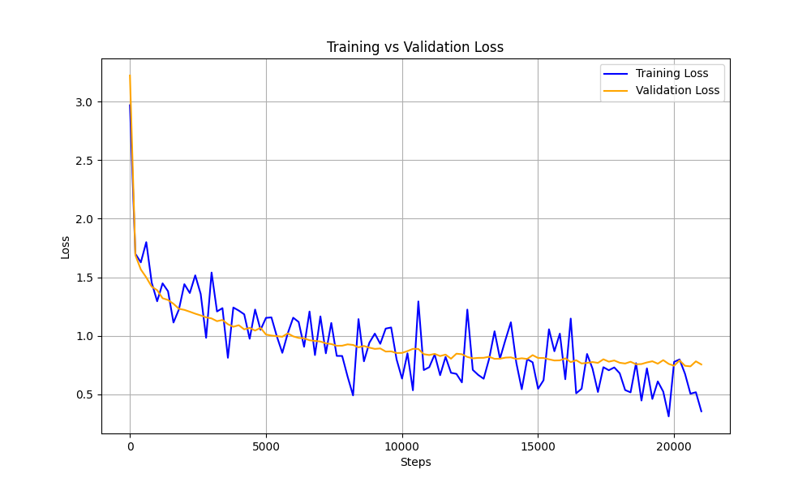

# Deep CNN for CIFAR-10 Classification

A Convolutional Neural Network built from scratch with PyTorch for image classification on the CIFAR-10 dataset.

## Results

| Version | Test Accuracy | Test Loss | Improvement |
|---------|---------------|-----------|-------------|
| v1 | 71.22% | 0.888 | — |
| **v2 (latest)** | **74.18%** | **0.783** | **+2.96% accuracy, -11.8% loss** |

### Training Progress



## Model Architecture

```
Input: [B, 3, 32, 32] (RGB images)
    │
    ├── Conv2d(3 → 64, k=4, p=1) → ReLU → BatchNorm2d → Dropout(0.1)
    │   Output: [B, 64, 31, 31]
    │
    ├── Conv2d(64 → 128, k=3) → ReLU → BatchNorm2d → AvgPool2d(k=3, s=3) → Dropout(0.1)
    │   Output: [B, 128, 9, 9]
    │
    ├── Flatten → [B, 10368]
    │
    ├── Linear(10368 → 100) → LayerNorm → Dropout(0.1)
    ├── Linear(100 → 50) → LayerNorm → Dropout(0.1)
    └── Linear(50 → 10) → Output
```

## Key Features

- **Regularization**: Batch normalization, layer normalization, and dropout (10%)
- **Optimizer**: AdamW with learning rate 1e-4
- **Data**: 90/10 train-validation split with normalization
- **Hardware**: Automatic device selection (MPS/CUDA/CPU)

## Quick Start

```bash
# Clone the repository
git clone https://github.com/VidyasagarDudekula/deep-cnn-cifar10.git
cd deep-cnn-cifar10

# Install dependencies
pip install torch torchvision matplotlib

# Train the model (downloads CIFAR-10 automatically)
python train.py
```

## Project Structure

```
├── train.py           # Model definition & training loop
├── load_dataset.py    # Data loading & preprocessing
├── test_stats.json    # Final evaluation metrics
└── training_loss_plot.png
```

## Dataset

[CIFAR-10](https://www.cs.toronto.edu/~kriz/cifar.html) consists of 60,000 32×32 color images in 10 classes:
- airplane, automobile, bird, cat, deer, dog, frog, horse, ship, truck

## Future Improvements

- [ ] Data augmentation (random crops, flips)
- [ ] Learning rate scheduling
- [ ] Deeper architecture (ResNet-style skip connections)
- [ ] Model checkpointing
